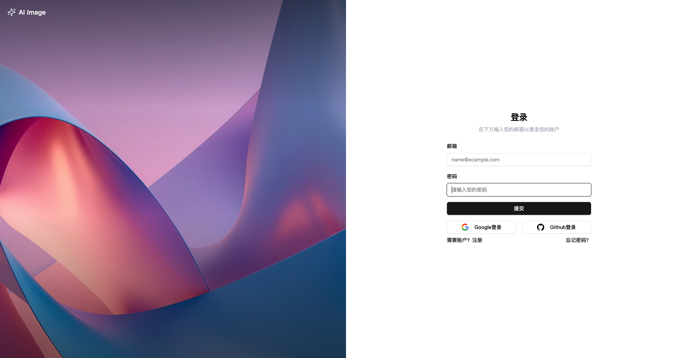
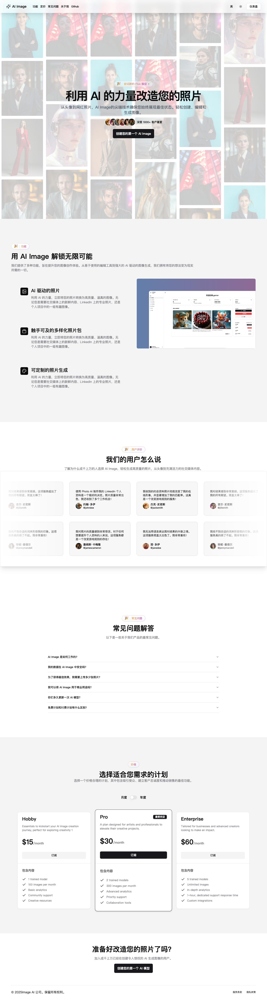
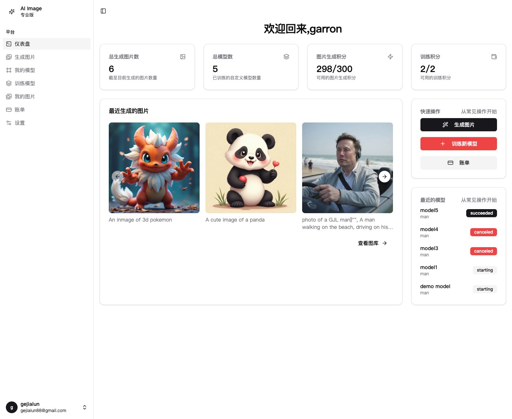
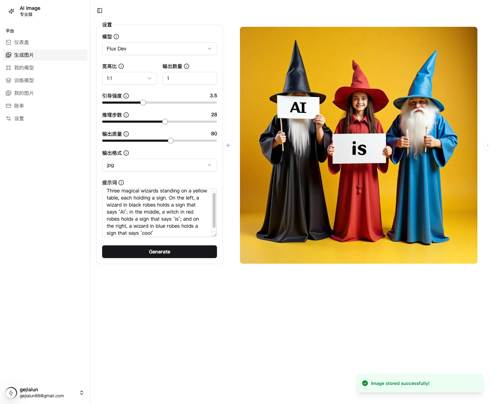
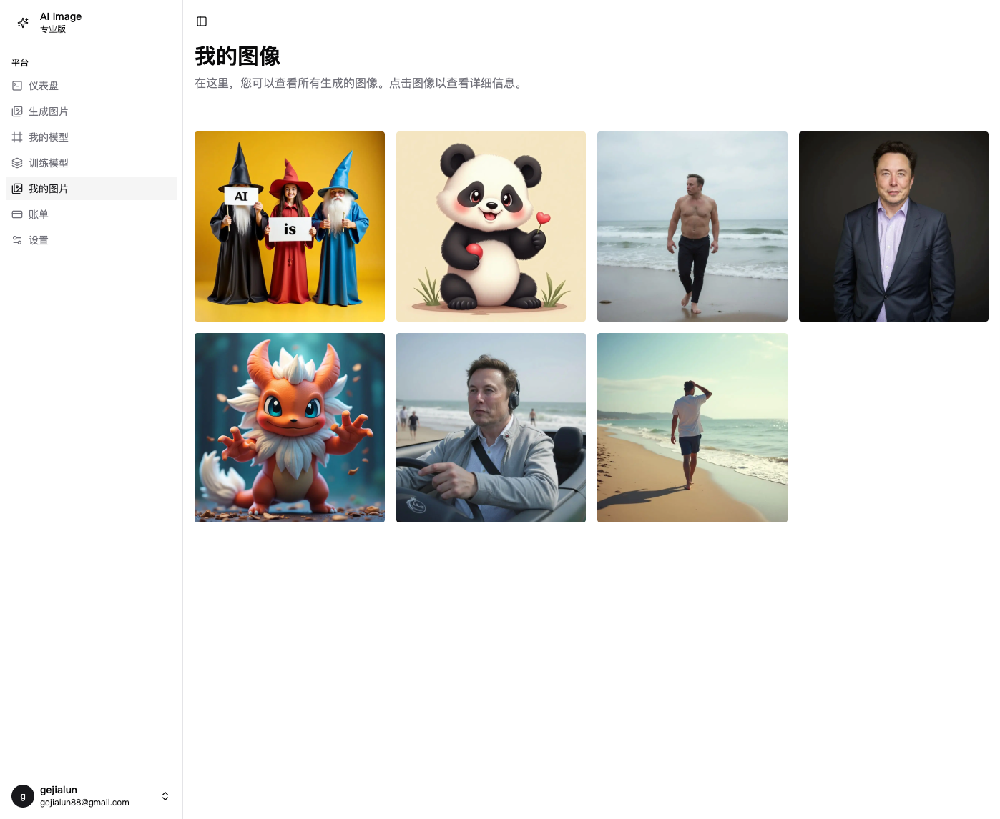
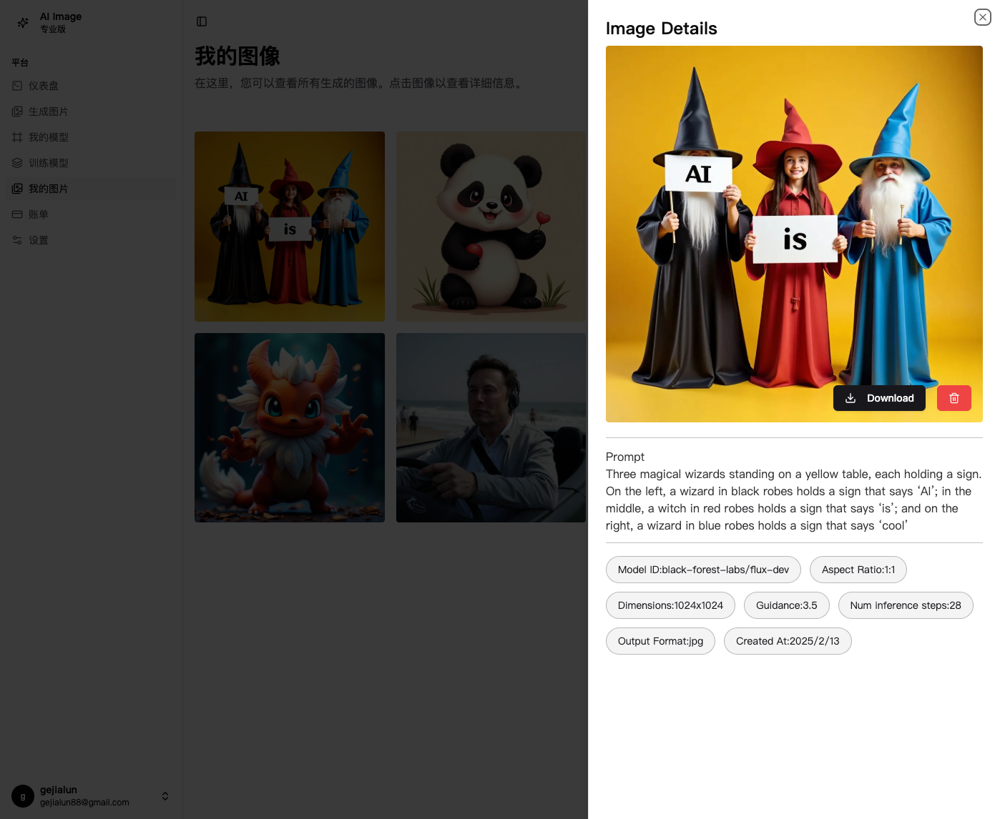
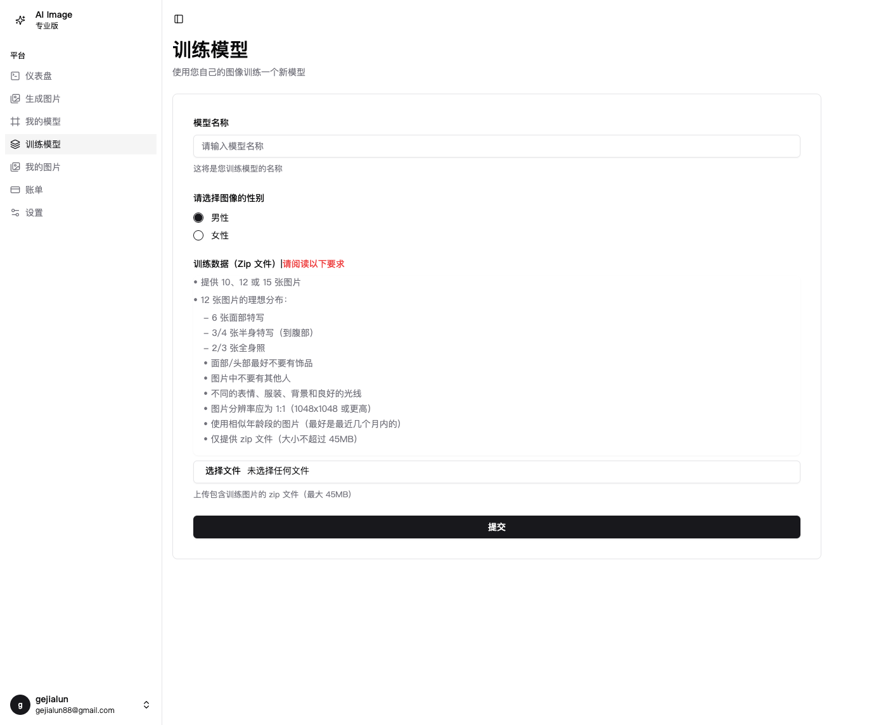
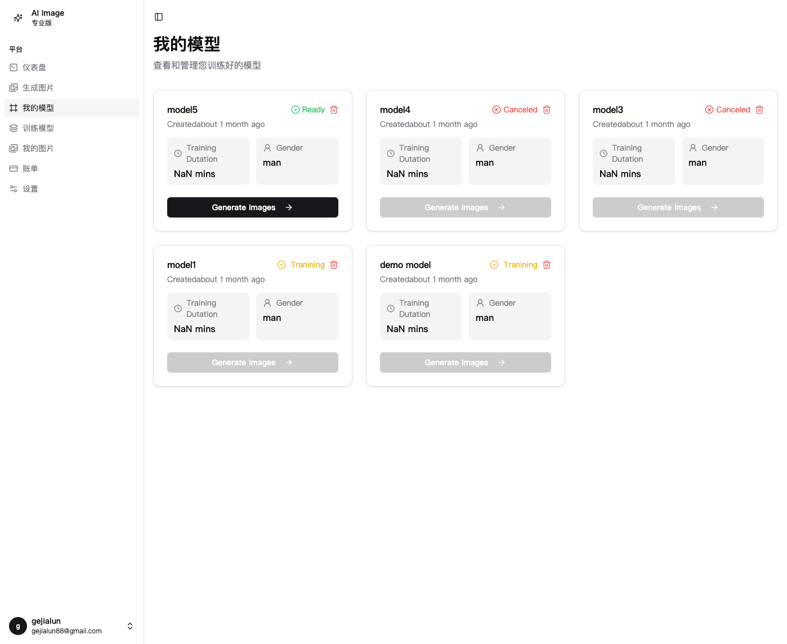
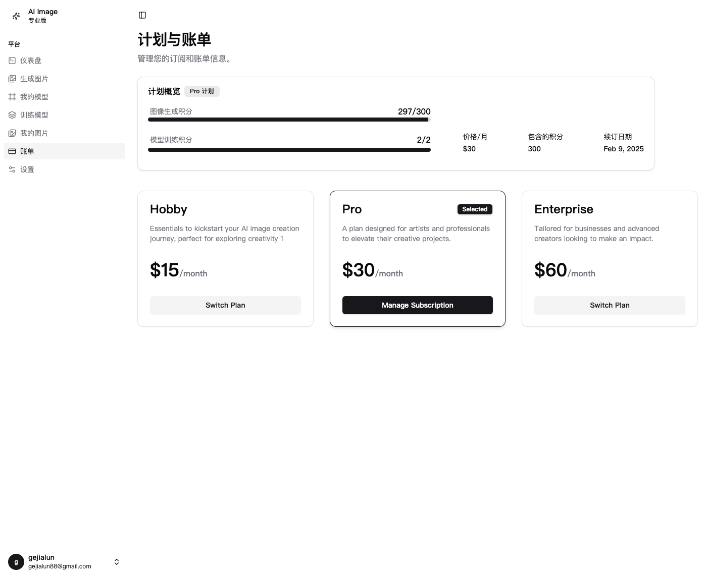

# AI Image 开源项目 🌟📷

## 概述 ✨

**AI Image** 项目是一个开源项目，用户可以生成图片、训练自定义模型，并通过多种功能管理账户，包括基于 Stripe 的支付、多语言支持、光暗模式切换等功能。项目使用了现代技术栈，如 Next.js、Supabase 和 Stripe，提供流畅的用户体验。

✨ **致力于帮助开发者、设计师和 AI 研究者轻松构建属于自己的 AI 生成图片工具！**

---

## 功能特点 🚀

### 核心功能 🌈

- **图片生成**：支持高质量的文本转图片与图片转图片功能。
- **自定义模型训练**：用户可以训练并部署自定义的 AI 模型。
- **图片与模型存储**：安全存储生成的图片和训练模型。
- **用户认证**：通过 Supabase 实现用户登录、注册和密码找回功能。
- **支付集成**：基于 Stripe 的安全高效支付与订阅管理。
- **账单与积分管理**：灵活设置账单与积分系统。

### 用户界面 🌟

- **多语言支持**：内置国际化支持，覆盖全球用户。
- **光暗模式切换**：支持光暗主题随意切换，提升用户体验。
- **响应式设计**：完美适配所有设备尺寸的界面。

---

## 技术栈 🛠️

### 前端 🎨

- **框架**：[Next.js](https://nextjs.org/) 提供服务器端渲染和优化性能。
- **样式**：使用 Tailwind CSS 和动画效果打造现代化视觉设计。

### 后端 💾

- **数据库**：通过 Supabase 实现认证、数据存储和实时功能。
- **支付**：使用 Stripe 实现安全高效的支付功能。
- **AI 模型**：与 [Replicate](https://replicate.com/) 集成，实现 AI 驱动的图片生成与模型训练。

### 工具 🧰

- **状态管理**：使用 Zustand 实现轻量高效的全局状态管理。
- **表单处理**：基于 React Hook Form 实现直观友好的表单交互。
- **国际化**：通过 Next.js Intl 实现多语言支持。
- **主题管理**：使用 Next Themes 实现光暗模式切换。

---

## 安装步骤 📥

### 前置要求

- Node.js (>= 18.x)
- npm 或 yarn
- Supabase 账户
- Stripe 账户

### 安装流程

1. 克隆代码库：
   ```bash
   git clone https://github.com/geallenboy/ai-image.git
   ```
2. 进入项目目录：
   ```bash
   cd ai-image
   ```
3. 安装依赖：
   ```bash
   pnpm install
   # 或者
   yarn install
   ```
4. 配置环境变量：
   复制 `.env.example` 文件并重命名为 `.env`
5. 启动开发服务器：
   ```bash
   pnpm run dev
   # 或者
   yarn dev
   ```
   在浏览器中访问 `http://localhost:3000`。

---

## 常用脚本 📜

### 可用命令

- `dev`：启动开发服务器。
- `build`：构建生产环境应用。
- `start`：启动生产环境服务器。
- `lint`：运行 ESLint 检查代码质量。

---

## 贡献指南 🤝

### 如何贡献

1. Fork 本仓库。
2. 创建新分支：
   ```bash
   git checkout -b feature-name
   ```
3. 提交更改：
   ```bash
   git commit -m "Add a feature"
   ```
4. 推送到分支：
   ```bash
   git push origin feature-name
   ```
5. 创建 Pull Request。

---

## 许可协议 📄

本项目基于 MIT 许可协议。详情请参阅 [LICENSE](LICENSE) 文件。

---

## 致谢 🙏

- [Next.js](https://nextjs.org/)
- [Supabase](https://supabase.com/)
- [Stripe](https://stripe.com/)
- [Replicate](https://replicate.com/)

---

## 联系方式 📧

如果你有任何问题、合作的想法，或者只是想打个招呼，随时与我联系！

- **电子邮件**：[gejialun88@gmail.com](mailto:gejialun88@gmail.com)
- **Twitter**：[@gejialun88](https://x.com/gejialun88)
- **个人网站**：[我的网站](https://gegarron.com)
- **微信号**：wxgegarron

🚀 立即开始，使用 AI Image 快速构建你的下一个 AI 驱动应用！

## 项目预览










